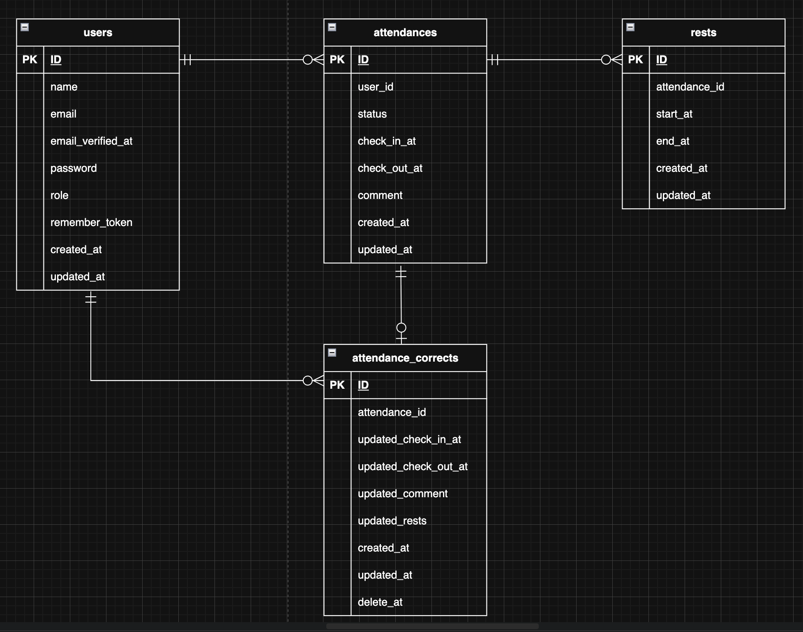

# coachtech 勤怠管理アプリ   
  
## 使用技術・実行環境  
- **Backend** : PHP 8.5.0 / Laravel 12.48.1
- **Frontend** : JavaScript (Vanilla JS), Tailwind CSS v4.0.0, Vite v7.0.7
- **Database** : MySQL 8.4.7
- **Infrastructure** : Laravel Sail (Docker環境)
- **Tooling** : Node.js v24.11.1, npm 11.7.0, Composer 2.9.2
- **Web Server** : Laravel Sail (PHP 8.5.0 Built-in Server) ※将来的にNginx導入予定
  
---  
## 設計のこだわり  
  
### 1. UIコンポーネントの共通化  
- **Bladeコンポーネントの活用**  
  ボタンやテーブル、詳細表示などのUIをコンポーネント化し、スタッフ側・管理者側で共通利用しています。  
  「1箇所の修正でシステム全体の表示を更新できる」保守性の高い設計を徹底しました。  
  
### 2. 労働時間・休憩時間の自動算出（アクセサの活用）  
- **法定休憩時間の自動適用**   
  労働基準法に基づき、滞在時間が6時間を超える場合は45分、8時間を超える場合は1時間の休憩時間を最低保証として自動計算します。
  DBに計算結果を持たないため、データの二重管理による不整合が発生しません。また、法改正などで休憩時間のルールが変わっても、
  １箇所のアクセサを修正するだけで、システム全体が即座に対応します。  
- **リアルタイム計算**:   
  DBに計算結果を持たず、取得時にモデル内で動的に計算（アクセサ）することで、修正申請などで時間が変わっても常に正確な合計時間を算出します。  
  
### 3. 修正申請の履歴管理  
- **申請データの独立化**   
  勤怠データ（attendances）を直接書き換えるのではなく、修正専用のテーブル（attendance_corrects）で管理。
  管理者が承認するまで元のデータを保護し、承認プロセスを安全に行えるようにしています。

---  
  
### ディレクトリ構造（主要部分）  
```text  
resources/views/
├── admin(管理者用ページ)
├── auth(ログイン関連・登録)
├── components(共通部品)
├── layouts(ヘッダー・全体枠組み)
└── staff(スタッフ用ページ)
```  
    
---  
## 環境構築

### 1. リポジトリのクローン  
- ターミナルでプロジェクトを作成する場所に移動
```bash
cd ...
```
- リポジトリのクローン  
```bash
#リポジトリのクローン
git clone git@github.com:haruki-saitou/attendance-app.git
cd attendance-app
```  
  
### 2.Laravel環境構築  
`.env`をコピーして、環境変数ファイルを作成します。  
> [!TIP]
※すでにDB設定が記載されているため、コピーするだけで動きます。  
```bash
cp .env.example .env
```  
テキストエディタでプロジェクトを開く   
```bash
code .
```  
  
---  
### 3.Sail本体のインストール（初回必須）  
クローン直後は vendor ディレクトリがないため、  
一時的なコンテナを使用して依存関係を解消します。  
```Bash
docker run --rm \
    -u "$(id -u):$(id -g)" \
    -v "$(pwd):/var/www/html" \
    -w /var/www/html \
    laravelsail/php84-composer:latest \
    composer install --ignore-platform-reqs
```
> [!TIP]
※フォルダの中に vendor という名前のフォルダが新しくできているか確認してください。  
※ .env ファイル内の APP_URL が http://localhost になっていることを確認してください。  

### 4. 実行環境（Sail）の初期化
Laravel Sailを使用して、MySQLやMailpit（メールテストツール）を含む開発環境の構成ファイルを自動生成します。  
```bash
docker run --rm \
    -u "$(id -u):$(id -g)" \
    -v "$(pwd):/var/www/html" \
    -w /var/www/html \
    laravelsail/php84-composer:latest \
    php artisan sail:install --with=mysql,redis
```  
  
---  
### 5.コンテナの起動と初期化
  
> ※Apple Silicon (M1/M2/M3) 及び Intel Mac/Windows の両方に対応。

> [!TIP]
**最初にDocker Desktopを開く**    
   
Dockerコンテナをバックグラウンドで起動。  
```bash
#Docker起動
./vendor/bin/sail up -d
```  
アプリの初期設定を一括で行います。(キー生成・DB構築)  
```bash
#キー生成・リンク作成・DB構築
./vendor/bin/sail artisan key:generate
./vendor/bin/sail artisan migrate:fresh --seed
```  
   
---  
### 6.フロントエンドのライブラリ（Tailwindなど）をインストール  
```bash
#ライブラリをインストール
./vendor/bin/sail npm install
```  
CSS/JavaScriptをビルド  
```bash
#ライブラリをビルド
./vendor/bin/sail npm run build
```  
```bash
#ライブラリの起動
./vendor/bin/sail npm run dev
```

> [!IMPORTANT]
※ `./vendor/bin/sail npm run dev` を実行しているターミナルは、閉じずにそのままにしておいてください。  


---  
### 7.メール認証の設定について  
開発環境でのメールテストには、Mailtrapを使用しています。  

「事前準備」  
1. [Mailtrap](https://mailtrap.io/ja/)にログインする。
> [!TIP]
※別タブで開くことを推奨します。
Macなら Command、Windowsなら Ctrl キーを押しながらクリックすると、
このページを閉じずに別タブで開くことができます。
2. マイサンドボックスを開き、⚙️設定内の Code Samples で Laravel 9+
に変更して表示された内容をcopyをクリックしてコピーする。
3. 表示された以下の情報を、プロジェクトの `.env` ファイルに反映してください。   
`MAIL_MAILER=smtp`  
`MAIL_HOST`  
`MAIL_PORT`  
`MAIL_USERNAME`  
`MAIL_PASSWORD`  
これにより、新規登録時の認証メールが Mailtrap の管理画面上で確認できるようになります。  
  
※アカウントがない場合  
1. [Mailtrap](https://mailtrap.io/ja/)でアカウントを作成する。  
2. サンドボックスを選択。  
3. メールサンドボックスのテストを開始する。  
4. カスタムでLaravelを選択。  
5. Code Samplesのセレクターで「Laravel 9+」を選択します。  
> [!TIP]
※表示された内容をcopyをクリックしてコピーしてください。  
6. 表示された以下の情報を、プロジェクトの `.env` ファイルに反映してください。
> `MAIL_MAILER=smtp`  
`MAIL_HOST`  
`MAIL_PORT`  
`MAIL_USERNAME`  
`MAIL_PASSWORD`  
  
---   
## テストケース  
本プロジェクトでは、テストケース一覧の要件に基づいた全16項目の自動テストを実装しています。  

※新しいターミナルを開いて実行してください。  
  
**テストの実行方法**  
```Bash
#全16項目の自動テストを実装
./vendor/bin/sail artisan test
```
  
### テストケース一覧
設計書に基づいた全16項目の自動テストを実装しています。  
機能テスト29個  
  
| テストファイル | 対応ID | 検証内容の要約 |
| :--- | :--- | :--- |
| **AuthTest** | 1, 2, 16 | スタッフの会員登録・ログイン、登録時のメール認証 |
| **AttendanceTest** | 4,5,6,7,8 | 現在時刻の表示、出勤・休憩・退勤、ステータス |
| **AttendanceListTest** | 9,10 | ログイン中スタッフ自身の勤怠一覧表示、詳細画面への遷移 |
| **CorrectionTest** | 11, 13, 15 | スタッフからの修正申請、管理者による修正承認・反映 |
| **AdminTest** | 3, 12, 14 | 管理者ログイン、全スタッフの勤怠一覧、スタッフ一覧表示 |
  
---  
  
### テスト用ログイン情報  
[**スタッフ**]   
- email :
```bash
staff1@example.com
```
※staffの後ろの数字を1〜10に変更するとそれぞれのダミーデーターを閲覧できます。  
- password : 
```bash
password
```
[**管理者**]   
- email :
```bash
admin@example.com
```
- password : 
```bash
password
```
> ※ migrate:fresh --seed 実行後に利用可能になります。  
  
1. `http://localhost/register` で新規会員登録を行う。  
2. `Mailpit` に届く認証メール内のリンクをクリックする。
3. ログイン後  
- スタッフは勤怠登録画面  
- 管理者は勤怠一覧画面  
  
---  
## 開発環境　  
MacBook Air M4を使用して開発。  
> [!TIP]
※各リンクは Command (Ctrl) + クリック で別タブで開くと、この手順書を見ながら作業できてスムーズです。
  
[**認証**]   
   
- 会員登録画面: http://localhost/register    
- ログイン画面: http://localhost/login  
- 管理者ログイン画面: http://localhost/admin/login  
- メール認証誘導画面: http://localhost/email/verify  
    
[**スタッフ**]   
  
- 勤怠画面(トップ画面): http://localhost/attendance  
- 勤怠一覧画面: http://localhost/attendance/list  
- 申請一覧画面: http://localhost/stamp_correction_request/list  
- 詳細画面: http://localhost/attendance/detail/{id}  
    
[**管理者**]   
  
- 勤怠一覧画面: http://localhost/admin/attendance/list    
- スタッフ一覧画面: http://localhost/admin/staff/list
- スタッフ別勤怠一覧画面: http://localhost/admin/attendance/staff/{id}
- 承認待ち一覧画面: http://localhost/stamp_correction_request/list （※スタッフと共通）
- 修正申請 承認・詳細画面: http://localhost/stamp_correction_request/approve/{attendance_correct_request_id}   
- 勤怠詳細画面: http://localhost/admin/attendance/{id}  
  
[**ツール**]  
  
- phpMyAdmin: http://localhost:8080/  
- mailpit: http://localhost:8025  
  
---  
  
## テーブル設計  
※全体設計として、ER図に基づきリレーションを構成しています。  
- users(1) : attendances(0または多) : １人のユーザーに複数の勤怠記録    
- attendances(1) : rests(0または多) : １回の勤怠に複数の休憩   
- attendances(1) : attendance_corrects(0または1) : １回の勤怠に１つの修正申請データ  
    
---  
  
### Usersテーブル(ユーザー情報)

| カラム名            | 論理名 | 型                | PRIMARY KEY | UNIQUE KEY | NOT NULL | FOREIGN KEY    |
| :--- | :--- | :--- | :---: | :---: | :---: | :---: |
| id                 | ID    | bigint unsigned  | **PK**         |    -        | ◯        |    -            |
| name               | 氏名   | varchar(255)     |     -        |     -       | ◯        |    -            |
| email              | メールアドレス | varchar(255)     |     -        | **UQ**        | ◯        |   -             |
| email_verified_at  | メール認証日時 | timestamp     |     -        |    -        |   -       |   -             |
| password           | パスワード    | varchar(255)     |    -         |    -        | ◯        |  -              |
| role               | 管理者:1、スタッフ:0       | tinyint     |   -          |  -          |  ◯        |    -            |
| remember_token     | ログイン保持用トークン            |varchar(100)     |   -          |  -          | -        |     -   |
| created_at         | 作成日時            |timestamp        |  -           |   -         | -        |     -           |
| updated_at         | 更新日時            |timestamp        |  -           |   -         | -        |     -           |

  
### attendancesテーブル(勤怠情報)

| カラム名            | 論理名 | 型                | PRIMARY KEY | UNIQUE KEY | NOT NULL | FOREIGN KEY    |
|:---|:---|:---|:---:|:---:|:---:|:---:|
| id                 | ID | bigint unsigned  | **PK**          |   -         | ◯        |    -            |
| user_id            | スタッフ | bigint unsigned  |     -        |  -          | ◯        | users(id)      |
| status       | 勤怠状態 | varchar(255)  |   -          |  -          | ◯        | -               |
| check_in_at               | 出勤時間 | datetime     |    -         |   -         | -        |    -            |
| check_out_at              | 退勤時間 | datetime |   -          |   -         | -        |   -             |
| comment         | 備考 | text     |  -           | -           |   -       |  -              |
| created_at         | 作成日時          |timestamp        |  -           |  -          | -        |   -             |
| updated_at         | 更新日時          |timestamp        |  -           |   -         | -        |   -             |

  
### attendance_correctsテーブル(修正申請情報)  
  
| カラム名            | 論理名 | 型                | PRIMARY KEY | UNIQUE KEY | NOT NULL | FOREIGN KEY    |
|:---|:---|:---|:---:|:---:|:---:|:---:|
| id                 | ID | bigint unsigned  | **PK**          |    -        | ◯        |    -            |
| attendance_id      | 勤怠ID | bigint unsigned  |     -        |   ◯         | ◯        | attendances(id)      |
| updated_check_in_at | 修正出勤時間 | datetime     |   -          |  -          | ◯        |   -             |
| updated_check_out_at | 修正退勤時間 | datetime     |  -           | -           | ◯        |    -            |
| updated_comment    | 修正理由 | text     |   -          |   -         | ◯        |     -           |
| updated_rests      | 修正休憩時間 | json     |  -           |  -          | ◯        |    -            |
| created_at         | 作成日時           | timestamp        |   -          |  -          | -        |   -             |
| updated_at         | 更新日時           | timestamp        |   -          |  -          | -        |   -             |
| deleted_at         | 削除日時           | timestamp        |   -          |  -          | -        |   -             |

  　
### restsテーブル(休憩情報）

| カラム名             | 論理名| 型                | PRIMARY KEY | UNIQUE KEY | NOT NULL | FOREIGN KEY    |
|:---|:---|:---|:---:|:---:|:---:|:---:|
| id                 | ID | bigint unsigned  | **PK**          |  -          | ◯        |     -           |
| attendance_id        | 勤怠ID | bigint unsigned  |    -         |    -        | ◯        | attendances(id)  |
| start_at         | 休憩開始 | datetime  |     -        |        -    | ◯        |                |  
| end_at           | 休憩終了 | datetime  |     -        |        -    | -        |                |
| created_at         | 作成日時 | timestamp        |     -        |        -    | -        |     -           |
| updated_at         | 更新日時 | timestamp        |      -       |         -   | -        |     -           |

  
---  
## ER図  
  
  
---  
## トラブルシューティング
`./vendor/bin/sail npm run dev` 実行時に  
`Cannot find module @rollup/rollup-linux-arm64-gnu` と出る場合  
Docker(Sail)環境とローカル環境の依存関係の不整合が原因です。  
以下の手順で依存関係をリセットしてください。  
  
**1. 念のため、現在動いているSailを停止させます**  
```bash
#現在動いているSailを停止
./vendor/bin/sail stop
```  
**2. 古い部品（フォルダ）と、設定の記録（ファイル）を削除します**  
> ※ Mac/Linuxのコマンドです。慎重に実行してください。  
```bash
#古い部品（フォルダ）と、設定の記録（ファイル）を削除
rm -rf node_modules package-lock.json
```  
**3. Sailをバックグラウンドで起動します**  
```bash
#Sailをバックグラウンドで起動
./vendor/bin/sail up -d
```   
**4. 改めて部品をインストールし直します**  
```bash
#再インストール
./vendor/bin/sail npm install
```  
**5. 再度、起動を試みます** 
```bash
#再起動
./vendor/bin/sail npm run dev
```  
   
